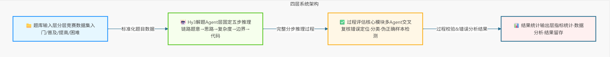

# Hy3 算法题AI过程评估与错误定位系统方案文档

## 项目简介

目前主流的算法AI评测工具，大多仅依托代码最终运行结果判定作答对错，属于典型的“唯结果论”评测方式。这种模式无法核查模型解题的思考逻辑与推导步骤是否合理，存在明显短板：大量代码运行结果正确、但核心解题思路存在缺陷的“伪正确样本”无法被识别，最终导致AI算法能力评测结果失真，不能真实反映模型的推理水平。

针对上述痛点，本项目基于Hy3框架，搭建一套以「分步解题 \+ 全流程过程评估」为核心的算法AI评测系统。项目摒弃传统单一结果校验模式，通过规范模型推理流程、引入多智能体交叉复核、专项识别伪正确样本等核心能力，实现算法解题全流程精细化评测，精准定位并归类解题错误，真实、全面量化AI模型的算法推理与实战解题能力。

## 一、设计思路

### 1\.1 现有方案短板

- **评测维度单一**：仅校验代码最终运行输出，只能简单判断测试样例是否通过，无法校验解题思路、推导逻辑的合理性，无法评估模型的真实思考能力。

- **伪正确样本无法甄别**：模型常出现“步骤推导出错、思路存在漏洞，但最终输出结果巧合正确”的情况，传统评测方式会直接判定作答正确，高估模型真实解题能力。

- **无精准错误定位能力**：仅能输出整体对错结论，无法定位具体出错步骤、划分错误类型，不能为模型迭代优化提供有效的问题依据。

### 1\.2 核心设计理念

本项目构建「生成端标准化推理 \+ 评估端全流程校验」的闭环评测体系，从源头解决传统评测片面性、结果失真的问题，核心设计思路如下：

- **生成端规范分步推理**：约束Hy3 Agent禁止直接生成代码，必须拆解完整解题流程，依次完成题意解读、解题思路推导、复杂度分析、边界条件梳理、代码编写全流程，全程无跳步，保证解题过程可追溯、可校验。

- **评估端全流程复核校验**：独立搭建过程评估模块，不再以结果为唯一标准，逐步骤核查推理逻辑，精准定位首个出错环节、自动归类错误类型，重点筛查伪正确样本，实现精细化、全方位的过程评测。

- **量化指标验证可靠性**：通过错误定位准确率、评测误报率等核心指标，验证评估模块自身的评测可靠性，同时结合题目难度分层，量化模型在不同场景下的推理能力差异。

## 二、系统整体架构

系统采用四层递进式架构，各层级职责独立、逐级依赖、层层联动，形成「数据输入 → 推理生成 → 过程评估 → 结果输出」的全自动评测流水线。以下为系统分层架构图：

各层级详细功能说明如下：

### 2\.1 题库输入层（数据基础）

为保障评测的专业性与全面性，项目搭建了一套标准化、分层级的算法评测数据集，为模型训练和性能评测提供可靠的数据支撑：

- **数据来源**：选取洛谷、Codeforces 主流公开算法竞赛真题，题目覆盖面广、权威性高，贴合真实算法解题场景。

- **难度分层**：结合竞赛标准，将题目划分为入门、普及、提高、困难四个梯度，全面覆盖不同难度的算法题型。

- **样本构成**：单条数据包含完整题干、多组全覆盖测试用例、官方标准题解，同时标注题目来源与难度划分依据，确保数据集可追溯、可复现。

### 2\.2 Hy3 解题Agent层（推理生成）

基于Hy3框架定制专属解题Agent，通过规则约束规范输出格式，杜绝跳步生成代码的问题，强制输出完整、规范的分步解题流程：

系统固定标准解题链路：**题意解析 → 解题思路推导 → 时间/空间复杂度分析 → 边界条件讨论 → 完整源代码实现**，五大环节缺一不可，保证每一步推理逻辑透明、可核查、可溯源。

### 2\.3 过程评估核心模块（系统核心）

本模块是系统核心，采用多Agent交叉复核机制，摆脱单一结果校验的局限，实现解题全流程的逻辑核查、错误定位与归类，核心能力分为五项：

- **过程正确性判定**：逐段核查解题推理链路，精准识别跳步作答、算法选型错误、复杂度估算偏差、边界条件缺失、逻辑矛盾等各类解题问题。

- **精准错误定位**：锁定整条解题链路中第一个出错步骤，规避后续错误叠加带来的干扰，精准定位问题根源。

- **标准化错误分类**：搭建完善的错误体系，涵盖题意误读、算法选型不当、复杂度计算错误、边界条件遗漏、逻辑推导错误、代码书写失误等常见问题类型。

- **伪正确样本识别**：核心创新功能，区分“解题逻辑合法性”和“代码运行结果正确性”，精准检出逻辑存在漏洞、但最终结果正确的伪正确样本。

- **多Agent交叉复核**：采用双智能体分工模式，解题Agent负责输出完整解答，独立校验Agent对照标准题解逐行核查逻辑，规避单一模型评测的主观性误差，提升评测准确度。

### 2\.4 结果统计输出层（量化输出）

该模块负责评测数据的自动化统计、结果分析与资料留存，可批量输出多维度评测指标，全面反映模型解题能力与系统评测可靠性，核心输出内容如下：

- 基础能力指标：代码最终答案准确率、解题推理过程正确率；

- 细分能力指标：各类错误占比分布、不同题目难度下的模型解题表现；

- 系统可靠性指标：错误定位准确率、评测误报率；

- 人工校验留存：自动记录人工抽检数据，为系统迭代、模型优化提供参考依据。

## 三、核心关键技术

### 3\.1 Hy3 Agent 分步推理约束技术

通过定制化Prompt约束策略，对Hy3解题Agent进行输出规范强制约束，引导模型主动拆解完整解题步骤，显性输出全部推理过程，彻底跳过“直接生成代码”的快捷输出模式，让所有解题过程都具备可评测、可追溯的条件。

### 3\.2 多Agent交叉审查机制

采用双智能体解耦协作模式，拆分解题生成与评测校验两大环节：解题Agent专注输出标准化分步解题流程，独立校验Agent以标准题解和算法原理为依据，无偏核查每一步推理逻辑，有效避免单一Agent评测的片面性，大幅提升过程评测的精准度。

### 3\.3 沙盒隔离式代码执行校验

搭建独立隔离的代码沙盒运行环境，统一执行模型生成的所有代码，批量运行各类测试用例，输出客观、真实的程序运行结果，作为评判代码答案是否正确的唯一依据，保障评测数据的安全性与真实性。

### 3\.4 伪正确样本识别技术

针对传统评测的核心短板，创新搭建“逻辑\+结果”双维度校验机制：分别核查解题推理逻辑的合理性、代码运行结果的正确性，精准甄别“逻辑推导不成立、但最终输出结果巧合正确”的伪正确样本，补齐传统评测的漏洞。

### 3\.5 全自动化评测与量化统计脚本

自主开发全套自动化评测脚本，支持数据集批量测试、评测指标自动统计、数据可视化分析与性能曲线绘制，可量化对比模型在不同难度题目下的推理能力差异，自动核算评估器定位准确率、误报率，实现评测全流程无人自动化执行。

## 四、项目预期效果

### 4\.1 功能效果

- 支持算法竞赛题目全流程分步输出，解题推理完整连贯、无跳步、可追溯；

- 过程评估模块可自动定位错误步骤、归类错误类型，完成智能化错误分析；

- 精准识别传统评测无法发现的伪正确样本，解决评测结果失真问题；

- 打通数据输入、解题生成、过程评估、结果统计全链路，实现全自动流水线评测。

### 4\.2 量化效果

- 输出双重核心指标：答案准确率、推理过程正确率，直观区分“结果正确”与“逻辑严谨”的能力差异；

- 完成难度分层能力测评，精准定位模型推理能力下滑的难度区间，明确模型能力边界；

- 输出评估器可靠性量化数据：错误定位准确率、评测误报率，搭配人工抽检记录，充分验证系统稳定性与可信度。

### 4\.3 项目完整产出物

- **开源项目仓库**：包含系统完整源码、过程评估核心模块、标准化README文档、环境配置模板、项目部署与运行指南；

- **评测配套材料**：分层算法竞赛题库、官方标准答案、代码自动校验脚本、全过程评估分析脚本；

- **项目分析报告**：详述过程评估设计思路、标准化错误分类体系、典型错题案例拆解、模型算法推理能力边界分析；

- **流程演示素材**：制作2分钟以内的演示GIF/视频，完整展示题目输入、分步解题、过程评估、结果输出的全业务流程。

## 五、项目实施时间规划

项目整体采用循序渐进的开发节奏，遵循“数据先行 → 生成端搭建 → 评估端开发 → 指标验证 → 交付收尾”的开发逻辑，各阶段产出物互为依托、层层递进，15天完成全流程开发、测试与验收，具体规划如下：

|阶段步骤|周期天数|阶段名称|核心工作内容|
|---|---|---|---|
|第1步|第1–3天|环境搭建 \+ 题库输入层建设|搭建Hy3基础运行环境、沙盒代码隔离执行环境；采集洛谷、Codeforces真题，按四大难度层级构建标准化评测数据集，完成题目来源、分层依据标注，夯实项目数据基础。|
|第2步|第4–6天|Hy3解题Agent层开发|定制专属Prompt约束规则，强制Agent输出完整五步推理链路，杜绝跳步生成代码，完成标准化分步解题管线开发、调试与功能验证。|
|第3步|第7–9天|过程评估核心模块开发|搭建多Agent交叉复核评估引擎，实现推理链路逐步骤校验、首个错误环节定位、错误类型自动归类，完成伪正确样本检测核心功能开发与调试。|
|第4步|第10–12天|结果统计层 \+ 自动化评测开发|编写批量自动化评测脚本，依托沙盒环境完成批量用例测试，实现答案准确率、过程正确率、错误分布、分层能力等指标自动统计，计算评估器定位准确率与误报率，绘制性能变化曲线。|
|第5步|第13–15天|产出物整理与项目验收|整理开源仓库全套代码与文档、评测配套材料、项目分析报告；制作2分钟内全流程演示素材；完成全系统功能走查、指标核验与项目整体验收。|

## 六、项目整体优势

- **评测维度创新**：打破行业传统结果导向的评测模式，聚焦解题推理过程核查，从根源解决伪正确样本评测失真的行业痛点；

- **评测精度更高**：依托多Agent交叉复核\+逐步骤逻辑校验，精准定位问题根源，细化错误分类，评测结果更贴合模型真实能力；

- **全流程自动化落地**：实现解题生成、过程核查、指标统计、结果输出全程自动化，支持批量评测，落地性强；

- **通用性与可复用性强**：分层题库、推理约束规则、评测脚本可复用至各类算法AI评测场景，拓展空间广；

- **交付成果标准化**：配套完整源码、文档、分析报告、演示素材，完全符合GitHub开源项目交付规范。

